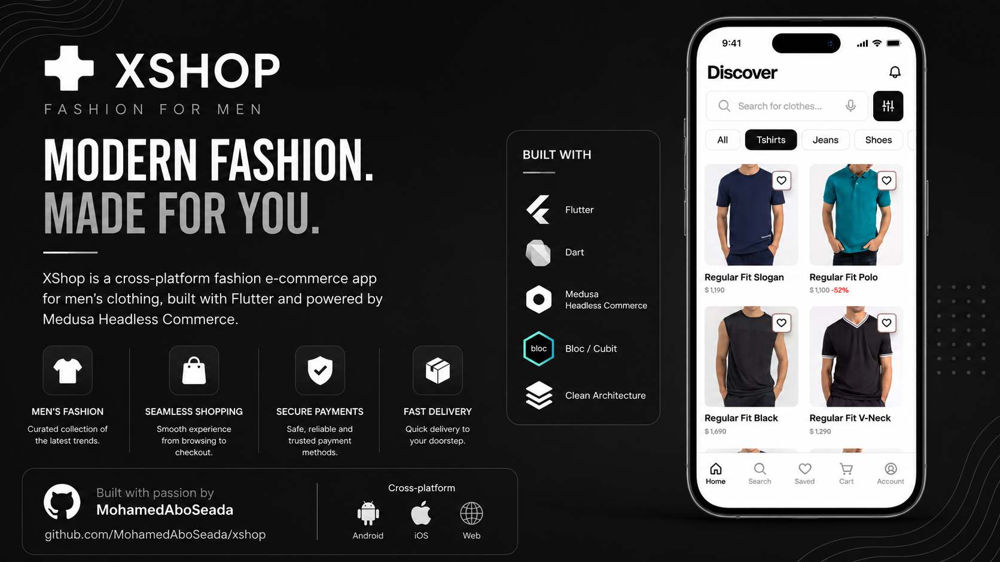

# 🛍️ XShop

## 🚀 Tech Stack

- **Flutter**
- **Dart**
- **Medusa.js (Headless Commerce)**
- **Bloc / Cubit**
- **Clean Architecture**

## 🎨 UI/UX Design

The application UI is based on the following Figma design:

**Figma Community:**  
[ECommerce App UI Kit (Freebie) (community)](https://www.figma.com/design/fA5aD177U405QwUbfyZDD1/Ecommerce-App-UI-Kit--Freebie---Community-?m=auto&t=TRuHyeMY6Eh4Rdg2-6)

## 📋 Roadmap

- [X] **Onboarding**

- [ ] **Authentication**
  - [X] Login
  - [X] Register
  - [ ] Reset Password
  - [ ] Logout

- [ ] **Product Discovery**
  - [ ] Home
  - [ ] Categories
  - [ ] Product Search
  - [ ] Product Filtering
  - [ ] Product Details
  - [ ] Product Reviews

- [ ] **Shopping Cart**
  - [ ] Add / Remove Products
  - [ ] Update Quantity
  - [ ] Wishlist Integration

- [ ] **Payment**
  - [ ] Checkout
  - [ ] Payment Methods
  - [ ] Third-party Payment Integration

- [ ] **Orders**
  - [ ] Order Tracking
  - [ ] Order History
  - [ ] Address Selection & Management

- [ ] **Notifications**
  - [ ] Order Updates
  - [ ] Promotions
  - [ ] In-app Notifications

- [ ] **Support**
  - [ ] Contact Support

## 🚧 Project Status

> 🚀 **Under Active Development**

This project is currently under development and new features are being implemented incrementally following the roadmap above.